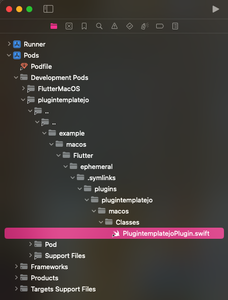
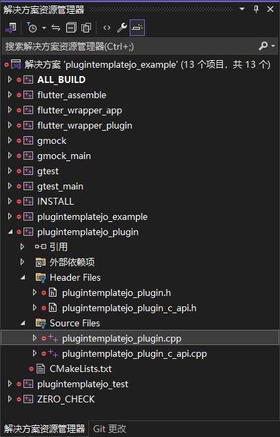

# plugintemplatejo

一个 Flutter 插件项目模板，用于记录 Flutter 是如何和原生语言交互。

Java + Objective-C 版本

[官方文档](https://docs.flutter.dev/packages-and-plugins/developing-packages#edit-plugin-package)

## 创建

本实例用的创建命令：

```bash
flutter create --org moe.yashi --template=plugin \
    --platforms=android,ios,linux,macos,windows \
    -a java -i objc plugintemplatejo
flutter pub get
```

添加更多平台：在项目目录中再次运行 `flutter create` 并使用 `--template=plugin` 标志。

```sh
flutter create --template=plugin --platforms=web .
flutter pub get
```

## 运行

```sh
# 在指定平台运行：
flutter run -d android
flutter run -d ios
flutter run -d linux
flutter run -d macos
flutter run -d windows
flutter run -d chrome # web
```

```sh
# 查看设备 ID 列表:
flutter devices
# 在指定设备上运行：
flutter run -d $device_id
```

## [Flutter 端代码](https://docs.flutter.dev/packages-and-plugins/developing-packages#step-2a-define-the-package-api-dart)

### `lib/plugintemplatejo.dart`

这是插件的主要入口文件，通常用来暴露插件提供的功能给 Dart 层使用。

- 定义插件的公共 API。
- 通过调用底层的 `platform_interface` 来实现平台交互。
- 如果插件是纯 Dart 实现，则可能直接在这个文件中完成所有逻辑。

### `plugintemplatejo_method_channel.dart`

定义使用 `MethodChannel` 与平台（如 Android 和 iOS）通信的逻辑。

- 继承或实现自 `plugintemplatejo_platform_interface.dart` 中定义的接口。
- 使用 Flutter 提供的 `MethodChannel` 在 Dart 层和原生代码之间通信。
- 处理平台特定的逻辑。

### `plugintemplatejo_platform_interface.dart`

定义插件的跨平台接口（Platform Interface），是所有平台实现的基础。

- 定义抽象类或接口，描述插件功能。
- 提供默认实现（可选）。
- 通过 `instance` 或其他设计模式，使 Dart 层能够使用具体的实现（如 `MethodChannel`）。
- 确保插件支持灵活的扩展性（如 Web 或其他平台实现）。

### 上面三个文件的关系

`plugintemplatejo.dart` 调用 `plugintemplatejo_platform_interface.dart` 定义的接口，接口的内容在 `plugintemplatejo_method_channel.dart` 。

- `plugintemplatejo.dart` 是入口文件，负责调用 `plugintemplatejo_platform_interface.dart` 中的接口。
- `plugintemplatejo_platform_interface.dart` 是插件的核心接口文件，定义了插件的功能。
- `plugintemplatejo_method_channel.dart` 提供了一个具体实现，使用 `MethodChannel` 与原生代码通信，并实现了接口中的功能。

通过这种结构，可以轻松扩展支持新的平台。这种分层设计让插件更易于维护、扩展和测试。例如：

- 使用 MethodChannel 处理 iOS 和 Android。
- 使用另一个 Dart-only 实现处理 Web。

## [Android 端代码](https://docs.flutter.dev/packages-and-plugins/developing-packages#step-2b-add-android-platform-code-kt-java)

在编辑代码之前，先至少构建过一次。

```sh
cd example
flutter build apk --config-only
```

1. 启动 `Android Studio`，在“欢迎使用 Android Studio”对话框中选择“打开现有 Android Studio 项目”，或从菜单中选择“文件 > 打开”，然后选择 `example/android/build.gradle` 文件。
2. 在 Gradle 同步对话框中，选择确定。在 Android Gradle 插件更新对话框中，选择此项目不再提醒我。

源码文件在 `Android Studio` 中: [android/src/main/java/moe/yashi/plugintemplatejo/PlugintemplatejoPlugin.java](android/src/main/java/moe/yashi/plugintemplatejo/PlugintemplatejoPlugin.java)

位于项目文件夹: 同上


## [iOS 端代码](https://docs.flutter.dev/packages-and-plugins/developing-packages#step-2c-add-ios-platform-code-swift-hplus-m)

在编辑代码之前，先至少构建过一次。

```sh
cd example
flutter build ios --no-codesign --config-only
cd ..
open example/ios/Runner.xcworkspace # 打开 Xcode
```

源码文件在 `Xcode` 中: `Pods/Development Pods/plugintemplatejo/../../example/ios/.symlinks/plugins/plugintemplatejo/ios/Classes/PlugintemplatejoPlugin.m` 。

位于项目文件夹: [ios/Classes/PlugintemplatejoPlugin.m](ios/Classes/PlugintemplatejoPlugin.m)

如果使用的是 `sharedDarwinSource` ，路径将以 `plugintemplatejo/darwin/Classes/PlugintemplatejoPlugin.m` 结尾。


### [添加 CocoaPod 依赖项](https://docs.flutter.dev/packages-and-plugins/developing-packages#add-cocoapod-dependencies)

1. 在项目的 `pubspec.yaml` 依赖中添加插件。
2. 运行 `flutter pub get`
3. 在项目的 `ios/` 目录中，运行 `pod install` 。

## [Linux 端代码](https://docs.flutter.dev/packages-and-plugins/developing-packages#step-2d-add-linux-platform-code-hplus-cc)

`Visual Studio Code` 安装插件 `C/C++` 和 `CMake`

在编辑代码之前，先至少构建过一次。

```sh
cd example
flutter build linux
```

1. 启动 Visual Studio Code。
2. 打开 `example/linux` 目录。
3. 提示 `Would you like to configure project "linux"?` 时选择“是”，允许 C++ 自动完成功能。

源码文件位于项目文件夹: [linux/plugintemplatejo_plugin.cc](linux/plugintemplatejo_plugin.cc)

## [macOS 端代码](https://docs.flutter.dev/packages-and-plugins/developing-packages#step-2e-add-macos-platform-code-swift)

在编辑代码之前，先至少构建过一次。

```sh
cd example
flutter build macos --config-only
cd ..
open example/macos/Runner.xcworkspace # 打开 Xcode
```

源码文件在 `Xcode` 中: `Pods/Development Pods/plugintemplatejo/../../example/macos/Flutter/ephemeral/.symlinks/plugins/plugintemplatejo/macos/Classes` 。

位于项目文件夹: [macos/Classes/PlugintemplatejoPlugin.swift](macos/Classes/PlugintemplatejoPlugin.swift)

如果使用的是 `sharedDarwinSource` ，路径将以 `plugintemplatejo/darwin/Classes` 结尾。



## [Windows 端代码](https://docs.flutter.dev/packages-and-plugins/developing-packages#step-2f-add-windows-platform-code-hplus-cpp)

在编辑代码之前，先至少构建过一次。

```bat
CD example
flutter build windows
CD ..
example\build\windows\x64\plugintemplatejo_example.sln
```

Visual Studio 安装 C++ 负载 Windows 10 SDK `10.0.20348.0` 而不是 `10.0.19041.0` ，否则 `No CMAKE_CXX_COMPILER could be found` 。

源码文件在 `Visual Studio` 中:

- `plugintemplatejo_plugin\Header Files\plugintemplatejo_plugin.h`
- `plugintemplatejo_plugin\Source Files\plugintemplatejo_plugin.cpp`

位于项目文件夹:

- [windows\plugintemplatejo_plugin.h](windows/plugintemplatejo_plugin.h)
- [windows\plugintemplatejo_plugin.cpp](windows/plugintemplatejo_plugin.cpp)



运行前:

1. 右键单击 `plugintemplatejo_example` 并选择“设为启动项目”
2. 选择“生成” > “生成解决方案”
